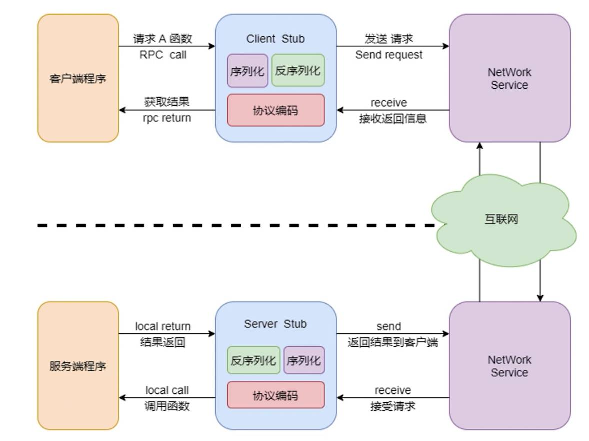

<!--
 * @Author: your name
 * @Date: 2021-05-21 17:45:04
 * @LastEditTime: 2021-05-21 17:45:16
 * @LastEditors: Please set LastEditors
 * @Description: In User Settings Edit
 * @FilePath: /go_notes/RPC框架/RPC入门.md
-->

RPC是远程过程调用的简称，是分布式系统中不同节点间流行的通信方式。在互联网时代，RPC已经和IPC一样成为一个不可或缺的基础构件。因此Go语言的标准库也提供了一个简单的RPC实现，我们将以此为入口学习RPC的各种用法。

# gRPC
- gRPC是一个高性能、开源、通用的 RPC 框架
- 基于 HTTP2.0协议标准设计开发
- 支持多语言，默认采用 Protocol Buffers 数据序列化协议

# Protocol Buffers
- 是一种轻便高效的序列化结构化数据的协议
- 通常用在存储数据和需要远程数据通信的程序上
- 跨语言，更小、更快、更简单
- 加速站点之间数据传输速度
- 解决数据传输不规范问题
<b>常用概念</b>
