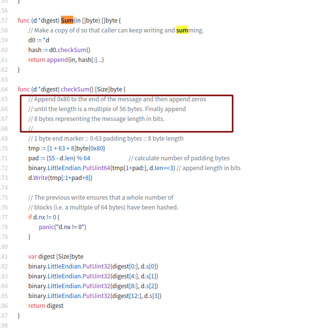

<!--
 * @Author: your name
 * @Date: 2021-07-05 15:47:26
 * @LastEditTime: 2021-07-05 16:22:29
 * @LastEditors: Please set LastEditors
 * @Description: In User Settings Edit
 * @FilePath: /go_notes/base/编码0x80.md
-->

读go源码包md5.New().Sum(data)接口源码 
- [注意md5.Sum(data)和 md5.New().Sum(data)区别](https://www.cnblogs.com/tkblack/p/11533874.html)

[go/src/crypto/md5/md5.go](https://github.com/golang/go/blob/master/src/crypto/md5/md5.go)时候看到这段：

> 将 0x80 附加到消息的末尾，然后附加零
  直到长度是 56 字节的倍数。 最后追加
8 个字节表示以位为单位的消息长度。

> 1 字节结束标记 :: 0-63 填充字节 :: 8 字节长度

 ASCII码表中，各种编码应该都要避免0x08和0x7f这两个字符，以及其他的控制字符。0x08就是'\b'，表示BackSpace，向前删除一个字符；0x7f则表示DEL，向后删除一个字符。另外说一下DEL的编码为什么是0x7f，我们都知道ASCII码是7位的，以前打纸带的时候，如果打错了，就要把所有位置全打上洞，表示这一个字节是无效的。所以7位的全1就用来表示DEL。

