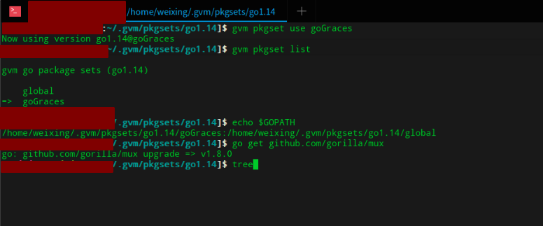

#! https://zhuanlan.zhihu.com/p/367756031
<!--
 * @Author: your name
 * @Date: 2021-04-02 18:04:16
 * @LastEditTime: 2021-04-25 17:58:58
 * @LastEditors: Please set LastEditors
 * @Description: In User Settings Edit
 * @FilePath: /go_notes/docs/GVM管理Go版本.md
-->
<b>GVM管理golang版本</b>
# GVM介绍
在 Go 项目开发中，团队要保持开发版本一致，怎么能够快速的安装及部署并且切换 Go 环境，在这里推荐一款工具 GVM （ Go Version Manager ），它可以便捷切换与自定义 Go Path 、Go Root 等参数，是一款实打实的多版本安装及管理利器。

是一个golang虚拟环境配置工具，其允许一台机器上安装多个golang版本，gvm是第三方开发的Go多版本管理工具，能做到Go语言版本的切换以及GOPATH的修改。


我们知道Go使用GOPATH这个环境变量来管理编译时的源代码路径，所以第三方库也是下载在GOPATH下，并且我们的源代码也需要处于GOPATH下。于是就需要一个工具，能根据方便的设置GOPATH

GVM，类似于 ruby 中的 RVM，java 中的 jenv（国产），可用于方便管理 Go 的版本，它有如下几个主要特性：

管理 Go 的多个版本，包括安装、卸载和指定使用 Go 的某个版本；
查看官方所有可用的 Go 版本，同时可以查看本地已安装和默认使用的 Go 版本；
管理多个 GOPATH，并可编辑 Go 的环境变量；
可将当前目录关联到 GOPATH；
可以查看 GOROOT 下的文件差异。

# 安装GVM
```bash
bash < <(curl -s -S -L https://raw.githubusercontent.com/moovweb/gvm/master/binscripts/gvm-installer)
```

查看版本：gvm version

查看版本失败，执行命令：sudo apt-get install bison

再次查看版本，执行命令：gvm version

# 使用GVM

```

使用GVM

查看当前机器的Go环境

$ gvm  list

查看所有可安装的Go版本

$ gvm listall

安装Go

$ gvm install go1.14

切换Go版本

$ gvm use go1.14

查看Go版本

$ go version
```

# 使用GVM pkgset

作用：在不同的go环境下面安装不同的包，实现多套go环境的包管理

```

pkgset使用

#自定义新的pkgset比如goGraces

gvm pkgset create goGraces

#应用goGraces

gvm pkgset use goGraces

#查看

gvm pkgset list

echo $GOPATH

#安装mux包，此时它被安装到goGraces 的pkgset下面

go get github.com/gorilla/mux
```

示例:

