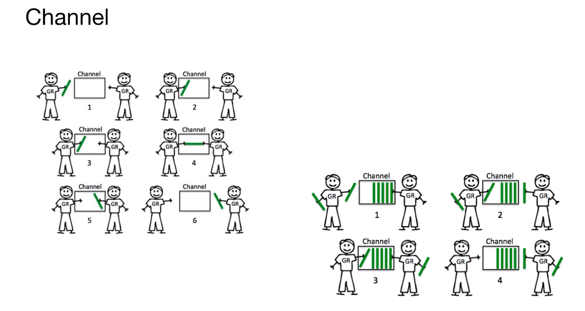

<!--
 * @Author: your name
 * @Date: 2021-05-26 14:56:38
 * @LastEditTime: 2021-05-26 19:41:27
 * @LastEditors: Please set LastEditors
 * @Description: In User Settings Edit
 * @FilePath: /go_notes/docs/Go 并发.md
-->


[常见并发模型]()


# 并发模型

## 共享内存
## CSP并发机制
> CSP(Communicating sequential processes)

**Actor Model**

**CSP vs Actor

- 和Actor的直接通讯不同，CSP模式则是通过channel进行通讯的，更松耦合一些
- GO中的channel是有容量限制并且独立处理Groutine,而如Erlang,Actor模式中的mailbox容量是无限的，接收进程也总是被动地处理消息
## 
<b>Goroutines 和 Channels</b>
# Go 并发 (goroutine)

在go语言中每一个并发的执行单元叫做一个Goroutines。通过go语句新建一个Goroutines。

Go 语言支持并发，我们只需要通过 go 关键字来开启 goroutine 即可。

goroutine 是轻量级线程，goroutine 的调度是由 Golang 运行时进行管理的。

goroutine 语法格式：

```
go 函数名( 参数列表 )
```
例如：
```
go f(x, y, z)
```
开启一个新的 goroutine:

```
f(x, y, z)
```

Go 允许使用 go 语句开启一个新的运行期线程， 即 goroutine，以一个不同的、新创建的 goroutine 来执行一个函数。 同一个程序中的所有 goroutine 共享同一个地址空间。

```
package main

import (
        "fmt"
        "time"
)

func say(s string) {
        for i := 0; i < 5; i++ {
                time.Sleep(100 * time.Millisecond)
                fmt.Println(s)
        }
}

func main() {
        go say("world")
        say("hello")
```
执行以上代码，你会看到输出的 hello 和 world 是没有固定先后顺序。因为它们是两个 goroutine 在执行：
```
world
hello
hello
world
world
hello
hello
world
world
hello
```

```

func main() {
    go spinner(100 * time.Millisecond)
    const n = 45
    fibN := fib(n) // slow
    fmt.Printf("\rFibonacci(%d) = %d\n", n, fibN)
}

func spinner(delay time.Duration) {
    for {
        for _, r := range `-\|/` {
            fmt.Printf("\r%c", r)
            time.Sleep(delay)
        }
    }
}

func fib(x int) int {
    if x < 2 {
        return x
    }
    return fib(x-1) + fib(x-2)
}

```
main中同时运行了两个函数，而不是按照顺序执行的，当主函数获得返回值时，所有的goroutine会被直接打断，spinner相当于一个等待时间的小动画。但是其实两个单元是可以通信的，继续。
# 通道（channel）


Channel是Go中的一个核心类型，你可以把它看成一个管道，通过它并发核心单元就可以发送或者接收数据进行通讯。
- go语言中并发可以通过两种途径实现。Goroutines和Channels支持“顺序通信进程”（CSP）。其是一种现代的并发变成模型，在这种编程模型中值会在不同的运行实例（Goroutines）中传递，尽管大多数时候都被限制在单一实例中。
- 多线程共享内存。

通道（channel）是用来传递数据的一个数据结构。

通道可用于两个 goroutine 之间通过传递一个指定类型的值来同步运行和通讯。操作符 <- 用于指定通道的方向，发送或接收。如果未指定方向，则为双向通道。

```
ch <- v    // 把 v 发送到通道 ch
v := <-ch  // 从 ch 接收数据
           // 并把值赋给 v
```
声明一个通道很简单，我们使用`chan`关键字即可，通道在使用前必须先创建：

```
ch := make(chan int)
```
注意：默认情况下，通道是不带缓冲区的。发送端发送数据，同时必须有接收端相应的接收数据。

以下实例通过两个 goroutine 来计算数字之和，在 goroutine 完成计算后，它会计算两个结果的和：
```

 package main

 import "fmt"
 
 func sum(s []int, c chan int) {
		 sum := 0
		 for _, v := range s {
				 sum += v
		 }
		 fmt.Println(sum)
		 c <- sum // 把 sum 发送到通道 c
 }
 
 func main() {
		 s := []int{7, 2, 8, -9, 4, 0}
 
		 c := make(chan int)
		//  fmt.Println(s[:len(s)/2])
		 go sum(s[:len(s)/2], c)
		 go sum(s[len(s)/2:], c)
		 x, y := <-c, <-c // 从通道 c 中接收
 
		 fmt.Println(x, y, x+y)
 }

// output:
// -5
// 17
// -5 17 12
// 
```

下面的代码我们在java中很常见
```java
// java中的future机制
// 当启动一个函数或者执行一个task时候，并不需要马上知道他的结果，当需要知道这个结果时候才去get这个结果(异步返回)
// 在这个期间可以执行一些其他的逻辑
// 当get这个结果时候如果结果还没出来，就会阻塞在那里，如果结果已经出来，就能get到，然后得到这个结果以后继续往下执行，这种机制可以大大提升程序的效率。

private static FutureTask<String> service() {
    FutureTask<String> task = new FutureTask<String>(()-> "Do someting")
    new Thread(task).start()
    return task;
}

FutureTask<string> ret = service();
    System.out.println("Do someting else");
    System.out.println(ret.get());
```

## 通道缓冲区
通道可以设置缓冲区，通过 make 的第二个参数指定缓冲区大小：

```
ch := make(chan int, 100)
```
带缓冲区的通道允许发送端的数据发送和接收端的数据的数据获取处于异步状态

## Go 遍历通道与关闭通道