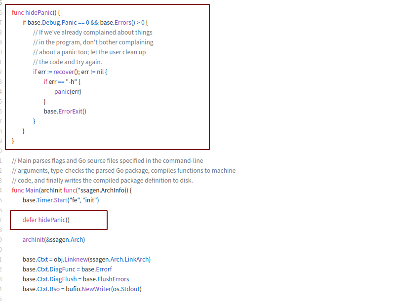
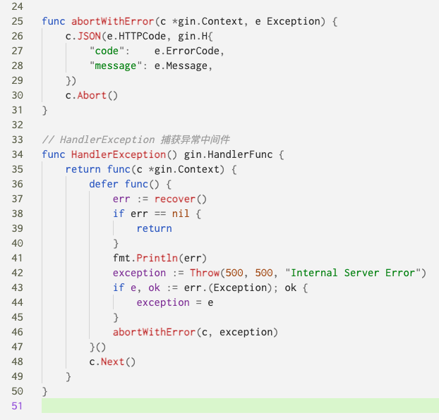

#! https://zhuanlan.zhihu.com/p/373653492
<!--
 * @Author: your name
 * @Date: 2021-04-06 15:39:06
 * @LastEditTime: 2021-05-19 20:04:02
 * @LastEditors: Please set LastEditors
 * @Description: In User Settings Edit
 * @FilePath: /go_notes/docs/Golang panic用法.md
-->

<b>GOlang panic用法</b>

Go语言追求简洁优雅，所以，Go语言不支持传统的 try…catch…finally 这种异常，因为Go语言的设计者们认为，将异常与控制结构混在一起会很容易使得代码变得混乱。因为开发者很容易滥用异常，甚至一个小小的错误都抛出一个异常。在Go语言中，使用多值返回来返回错误。不要用异常代替错误，更不要用来控制流程。在极个别的情况下，也就是说，遇到真正的异常的情况下（比如除数为 0了）。才使用Go中引入的Exception处理：defer, panic, recover。

这几个异常的使用场景可以这么简单描述：Go中可以抛出一个panic的异常，然后在defer中通过recover捕获这个异常，然后正常处理。

```
package main

import "fmt"

func main(){
    fmt.Println("c")
     defer func(){ // 必须要先声明defer，否则不能捕获到panic异常
        fmt.Println("d")
        if err:=recover();err!=nil{
            fmt.Println(err) // 这里的err其实就是panic传入的内容，55
        }
        fmt.Println("e")
    }()

    f() //开始调用f
    fmt.Println("f") //这里开始下面代码不会再执行
}

func f(){
    fmt.Println("a")
    panic("异常信息")
    fmt.Println("b") //这里开始下面代码不会再执行
    fmt.Println("f")
}


输出结果：

c
a
d
异常信息
e
```

# panic：

- 内建函数
- 假如函数F中书写了panic语句，会终止其后要执行的代码，在panic所在函数F内如果存在要执行的defer函数列表，按照defer的逆序执行
```
比如panic函数内有：
    defer   函数1
    defer   函数2
    defer   函数3
那么执行顺序就是：
    函数3
    函数2
    函数1
```

- 返回函数F的调用者G，在G中，调用函数F语句之后的代码不会执行，假如函数G中存在要执行的defer函数列表，按照defer的逆序执行，这里的defer 有点类似 try-catch-finally 中的 finally
- 到goroutine整个退出，并报告错误
# recover：

- 内建函数
- 用来控制一个goroutine的panicking行为，捕获panic，从而影响应用的行为
- 一般的调用建议(如上面的例子)
a). 在defer函数中，通过recever来终止一个gojroutine的panicking过程，从而恢复正常代码的执行
b). 可以获取通过panic传递的error
简单来讲：go中可以抛出一个panic的异常，然后在defer中通过recover捕获这个异常，然后正常处理。


注意：利用recover处理panic指令，defer必须在panic之前声明，否则当panic时，recover无法捕获到panic．

# 应用示例： 

比如[go编译器的源码](https://github.com/golang/go/blob/master/src/cmd/compile/internal/gc/main.go)
> 注释: 编译器是构建正在运行的二进制文件的编译器工具链的名称。已知的工具链为：
> gc      Also known as cmd/compile.
gccgo   The gccgo front end, part of the GCC compiler suite.


# 介绍 错误和异常 (errors and exceptions)

大多数编程语言支持 exception 作为处理 error 的标准方式，比如 Java，Python。虽然方便，但也会带来许多问题，这就是为什么他们不喜欢其他语言或者风格。对 exception 的主要吐槽点是它们为控制流引入了 "side channel"，当阅读代码的时候，你必须时刻记住这个 exception 引发的流程控制方向。这也导致某些代码阅读起来比较困难[1]。

让我们开始具体谈谈 Go 中的错误处理。我假定你知道 Go 中错误处理的“标准”方式。下面如何打开文件的代码：

```
f, err := os.Open("file.txt")
if err != nil {
    // handle error here
}
// do stuff with f here

```
如果文件不存在， os.Open() 函数将返回一个非空 error ，在其他语言中这样的错误处理是完全不同的，比如 Python 中的内建 open() 函数将在错误发生时抛出异常。

```
try:
    with open("file.txt") as f:
        # do stuff with f here
except OSError as err:
    # handle exception err here
```

Python 始终坚持通过 exception 来处理 error。因为这种无处不在的错误处理方式导致经常被吐槽。甚至利用 exception 作为序列结束的信号。到底 exception 的真正含义是什么？以下是来自 Rob Pike 在邮件中 对此的贴切阐述，其中塑造了现有的 Go panic/recover 机制雏形。

> 这正是提案试图避免的那种事情。 Panic 和 recover 不是通常意义的异常机制。通常的方式是将 exception 和一个控制结构相关联，鼓励细粒度的 exception 处理，导致代码往往不易阅读。在 error 和调用一个 panic 之间确实存在差异，而且我们希望这个差异很重要。在 Java 中打开一个文件会抛出异常。在我的经验中，打开文件失败是最平常不过的事。而且还需要我写许多代码来处理这样的 exception。

客观的讲。exception 的支持者嘲笑 Go 的这种过于明确的 error 处理有多方面的原因。首先，请注意上面两个例子中代码的顺序。 在 Python 中，程序的主要流程紧跟在 open 调用之后，并且错误处理被委托给后一阶段（更不用说在许多情况下，异常将被堆栈中更上一级的函数捕获到而不是在此函数中）。 另一方面，在 Go 中，立刻处理错误这种方式，可能会使主程序流程混淆。 此外，Go 的错误处理非常冗长 - 这是该语言的主要吐槽点之一。 我将在后面提到一种可能的方法来解决这个问题。

除了上面 Rob 的引用之外，在 FAQ 中总结了 Go 的 exception 哲学。

> 我们认为将异常耦合到控制结构（如 try-catch-finally 惯用语）会导致代码错综复杂。 它还倾向于鼓励程序员标记太多普通错误，例如打开文件失败。

然而，在某些情况下，具有类似异常的机制实际上是有用的 ; 像 Go 这样的高级语言甚至是必不可少的。 这就是存在 panic 和 recover 的原因。

# 偶尔的 panic 是必要的
Go 是一种安全的语言，运行时检查一些严重的编程错误。例如在你访问超出 slice 边界的元素时，这种行为是未定义的，因此 Go 会在运行时 panic。例如下面的小程序。

```
package main

import (
    "fmt"
)

func main() {
    s := make([]string, 3)
    fmt.Println(s[5])
}
```
程序将终止于一个运行时 error。

```
panic: runtime error: index out of range

goroutine 1 [running]:
main.main()
    /tmp/sandbox209906601/main.go:9 +0x40
```

其他一些会引发 panic 的就是通过值为 nil 的指针访问结构体的字段，关闭已经关闭的 channel 等。怎样选择性的 panic ？可以通过访问 slice 时返回 result，error 两个值的方式实现。也可以将 slice 的元素赋值给一个可能返回 error 的函数，但是这样会将代码变复杂。想象一下，写一个小片段，foo，bar，baz 都只是一个字符串的一个 slice，实现片段之间的拼接。

```
foo[i] = bar[i] + baz[i]

```

就会变成下面这样冗长的代码：

```
br, err := bar[i]
if err != nil {
    return err
}
bz, err := baz[i]
if err != nil {
    return err
}
err := assign_slice_element(foo, i, br + bz)
if err != nil {
    return err
 }
```

这不是开玩笑，不同语言处理这样的方式是不一样的。如果 slices/lists/arrays 的指针 i 越界了，在 Python 和 Java 中就会抛出异常。C 中没有越界检查，所以你就可以尽情的蹂躏边界外的内存空间，最后将导致程序崩溃或者暴露安全漏洞。C++ 中将采用折中的处理方式。性能优先的模块采用这种不安全的 C 模式，其他模块（比如 std::vector::at）采用抛出异常的方式。

因为上面重写的小片段变得如此冗长是不可接受的。Go 选择了 panic ，<b>这是一种类似异常的机制，在代码中保留了像 bugs 这样最原始的异常条件。</b>

这不只是内建代码能够这样用，自定义代码也可以在任何需要的地方调用 panic。在有些可能导致可怕错误的地方还鼓励使用 panic 抛出 error，比如 bug 或者一些关键因素被违反的时候。比如在 swich 的某个 case 在当前上下文中是不可能发生的，在这种 case 中只有一个 panic 函数。这无形中等价于 Python 中的 raise 或者 C++ 中的 throw。这也强有力的证明了在捕获异常方面 Go 的异常处理的特殊之处。

# Go 中 panic 恢复的限制条件

# 讨论

一般就HTTP服务的全局做一个recover,然后任何地方panic都能全局捕获相应一个错误



# 拓展阅读
[On the uses and misuses of panics in Go](https://eli.thegreenplace.net/2018/on-the-uses-and-misuses-of-panics-in-go/)

https://zhuanlan.zhihu.com/p/222367644