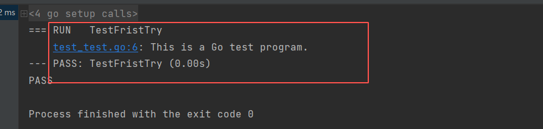

<!--
 * @Author: your name
 * @Date: 2021-04-01 20:55:30
 * @LastEditTime: 2021-04-02 16:09:31
 * @LastEditors: Please set LastEditors
 * @Description: In User Settings Edit
 * @FilePath: /go_notes/docs/搭建go开发环境.md
-->
# 一、Go 语言环境安装
1、下载二进制包

安装包下载地址为：https://golang.org/dl/。


如果打不开可以使用这个地址：https://golang.google.cn/dl/


各个系统对应的包名：

|    操作系统 | 包名  |
|  ----  | ----  |
| Mac  | go1.16.2.darwin-amd64.pkg  |
| Linux  | go1.16.2.linux-amd64.tar.gz  |
| Windows  | go1.16.2.windows-amd64.msi |

2、 解压到/user/local 目录

```

tar -C /usr/local -xzf go1.16.2.linux-amd64.tar.gz
```

3、将 /usr/local/go/bin 目录添加至PATH环境变量(配置 GOROOT  GOPATH  PATH等环境变量)
- 注意：GOPATH路径需要包含你的项目空间路径，支持多个

> You can do this by adding the following line to your $HOME/.profile or /etc/profile (for a system-wide installation):
```
export PATH=$PATH:/usr/local/go/bin
```


> Note: Changes made to a profile file may not apply until the next time you log into your computer. To apply the changes immediately, just run the shell commands directly or execute them from the profile using a command such as source $HOME/.profile.


```
source /etc/profile
```

4、验证安装完毕
```
go version
```

5、 go env


# 二、vscode的安装
   VS Code 是微软提供的一款轻量级但功能十分强大的编辑器
1、安装地址
https://code.visualstudio.com/download
VS Code的安装比较简单，一直下一步即可。

2、相关配置
在 文件 →  首选项 → 设置 → 用户设置  做如下配置
```
{
   "go.useCodeSnippetsOnFunctionSuggestWithoutType": true,
   "go.inferGopath": false,
   "files.autoSave": "afterDelay",
   "go.gocodeAutoBuild": true,
   "go.gopath":"开发目录1:开发目录2",
   "go.useCodeSnippetsOnFunctionSuggest": true,
   "go.gotoSymbol.includeImports": true,
   "go.gocodePackageLookupMode": "go",
   "go.autocompleteUnimportedPackages":true,
    "window.zoomLevel": 0, // 表示VSCode默认的窗口缩放指数值为0
    "go.formatTool": "goimports",
    "go.testFlags": [
        "-v",
        "-count=1",
    ],
    "gitlens.advanced.messages": {
        "suppressShowKeyBindingsNotice": true
    }
}

```
然后在扩展卡中下载

|    Chinese(Simplified) Language Pack for Visual Studio Code| 
|  ----  | 
| Go| 
| GitLens|
| Git Blame  |

这些工具包可以帮助你更好的办公


# 三、Goland开发
JetBrains 的 GoLand——常规安装
https://www.jetbrains.com/go/download/#section=windows

# 四、 输出Hello World
```buildoutcfg
package main

import "fmt"

func main()  {
   fmt.Println("Hello World!!!")
}

//输出结果：Hello World!!!
```

# 五、不用语言的区别
## 区别：
**和c语言的区别：**
- 相同：package与include大致相似（初步感受）
- 不同：import导入； printf 与 fmt.Println; 每个语句的结尾不需要封号(;)； main没有声明返回类型

**和java的区别：**
- 相同：import导入
- 不同：不需要类的支撑； 每个语句不需要封号(;) 结尾； main没有声明返回类型。

给出C和Java的相应输出形式，供比较。

```editorconfig 
#include<stdio.h>
int main(){
    printf("Hello World!!!");
    return 0;
}

public class Main{
    public static void main(String[] args){
        System.out.println("Hello World");
    }
}

```

**初步总结：**
1. Go的import大致与C的include相似，导入相应的包，可是使用包内的东西；但是C在使用的时候不写包名直接使用；而Go和java都需要在使用时带相应的包名。
2. Go的main函数不需要返回类型（暂不知道其他函数需不需要返回类型），这点和C与Java是截然不同的，C和Java的main函数是一定的需要返回类型的，就算不返回任何实际的东西，也得用void空返回。

**注意：**
4. 必须为 package main（与java区别package与文件名可以不一致）
5. 必须为 main方法——func main(){}
6. 文件名不一定为main
7. import的写法与java有一定的区别。

**Go的测试文件：** 
Go支持测试文件，文件名必须以_test.go结尾

```golang
package test_test

import "testing"

func TestFristTry(t *testing.T){
   t.Log("This is a Go test program.")
}

//输出见下图
```



# 六、环境变量


# 七、工具和功能


