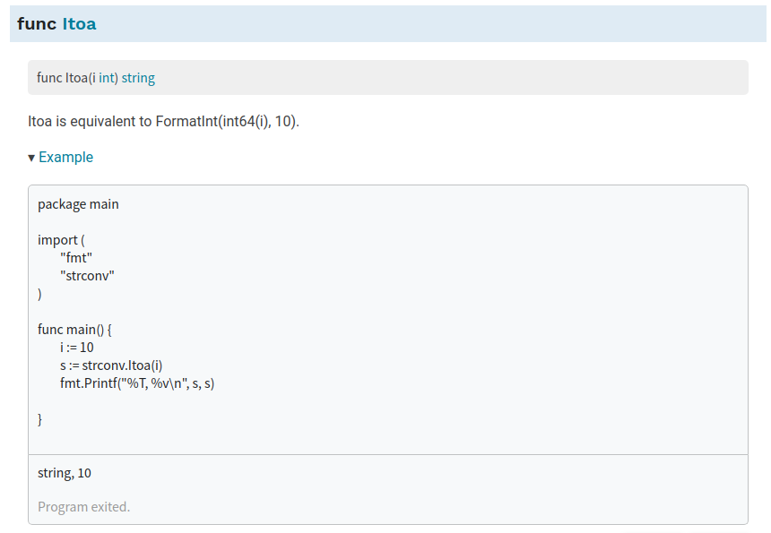

<!--
 * @Author: your name
 * @Date: 2021-07-02 16:29:18
 * @LastEditTime: 2021-07-02 16:58:07
 * @LastEditors: Please set LastEditors
 * @Description: https://tutorialedge.net/projects/building-security-tools-in-go/building-port-scanner-go/
 * @FilePath: /go_notes/docs/building security tools in Go.md
-->

如何在 Go 中实现我们自己的简单端口扫描工具，它可以帮助我们更好地评估我们开发和部署的系统是否存在任何安全漏洞。
# 端口扫描

端口扫描是遍历机器上的每个端口并检查哪些端口是打开、关闭或过滤的行为。 在一台典型的机器上总共有超过 130,000 个端口，其中 65535 个是 TCP 端口，另外 65535 个是 UDP 端口。 如果保持打开状态，这些端口中的每一个都可以有效地进入您的系统，并且端口扫描允许安全工程师查看是否有任何潜在方法可以从未打补丁的软件访问您的系统。

> HTTP 使用端口 80，HTTPS 使用端口 443

# 使用go扫描端口

```golang
# go_scan_a_port.go


```

## strconv.Itoa()



strconv.Itoa()函数的参数是一个整型数字，它可以将数字转换成对应的字符串类型的数字。


Go不会对数据进行隐式的类型转换，只能手动去执行转换操作。

详情可以查看此文章[Go基础系列：数据类型转换(strconv包)](https://www.cnblogs.com/f-ck-need-u/p/9863915.html)

##  net.DialTimeout

网络超时包含在多个环节中，比如连接超时、请求超时和响应超时，我们先来看连接超时。

### 连接超时

在使用 Dial 函数建立网络连接时，可以使用 net 包提供的 DialTimeout 函数主动传入额外的超时参数来建立连接，该函数原型如下：
```

func DialTimeout(network, address string, timeout time.Duration) (Conn, error) {
    d := Dialer{Timeout: timeout}
    return d.Dial(network, address)
}
```

和 Dial 函数调用一样，只是设置了超时字段而已，如果使用 Dial 函数，默认会通过操作系统提供的机制来处理连接超时，对于 TCP 连接，通常是 3 分钟左右，这对我们的程序来说，可能太长了，这个时候，就可以通过 DialTimeout 来建立连接

如果请求国外被封的域名，比如 facebook.com，程序可能长时间没有反应，将建立网络连接的代码调整如下：

```
// 建立网络连接
conn, err := net.DialTimeout("tcp", service, 3 * time.Second)
```
再次请求，3 秒后就会返回超时错误退出：
