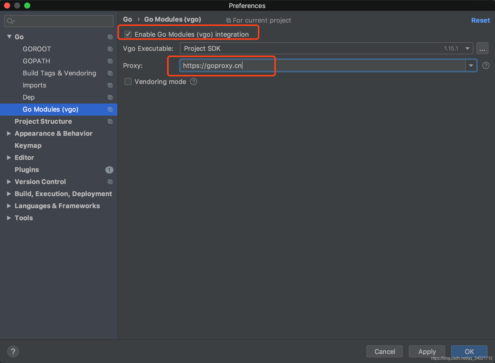
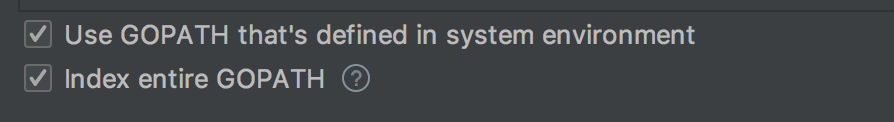

<!--
 * @Author: your name
 * @Date: 2021-04-08 09:47:15
 * @LastEditTime: 2022-03-08 11:35:00
 * @LastEditors: Please set LastEditors
 * @Description: In User Settings Edit
 * @FilePath: /go_notes/docs/go modules.md
 * ＠reference : https://blog.csdn.net/qq_34021712/article/details/109146367
-->
https://blog.golang.org/using-go-modules

https://github.com/golang/go/wiki/Modules

Go Module：https://www.bilibili.com/video/av63052644/

# module介绍
go module是go新的依赖包管理系统,go module 是go语言从1.11版本之后官方推出的版本管理工具，基于vgo演变而来，是一个新型的包管理工具，在go1.11和go1.12该功能还在试验阶段,从go 1.13开始,go module 成为了go语言默认的依赖管理工具,从go1.14开始已经用于生产环境，并且鼓励所有用户从其他依赖包管理系统迁移到go module。

Go 1.14 Go Modules 终于可以投入生产了。除非你有特定的理由不使用它们，否则使用 Go Modules 。如果你使用，就无需担心 $GOPATH 以及项目放置的位置。存储库中的 go.mod 文件基本假定你的项目托管在 Github 上，但这不是要求。模块路径可以是任何地方，尽管第一个模块路径组件的名称中应该有一个点（当前版本的 Go 不再强制使用该模块，但如果使用稍旧的版本，如果没有 mod 文件构建失败的话 ，不要惊讶）。如果你想知道更多信息，请参阅 [Issues 37554](https://github.com/golang/go/issues/37554) 和 [32819](https://github.com/golang/go/issues/32819) 。

#　go.mod文件
go.mod文件是在项目的根目录下，是个Go依赖包的集合。包含go.mod文件的目录也被称为模块根,这个go.mod文件定义了Go依赖包的路径，也是项目使用的导入路径，还包括使依赖包能够成功构建的依赖需求。每个依赖包都包括一个路径和使用的特定版本。

例如以本项目为例,项目内的go.mod文件:


# 如何使用 go module ？

## 第一步
首先需要把 golang 升级到 1.11 版本以上,我使用的是 1.15。

## 第二步: 设置 GO111MODULE
在Go语言1.12版本之前，要启用 go module 工具首先要设置环境变量 GO111MODULE，不过在Go语言 1.13 及以后的版本则不再需要设置环境变量。通过 GO111MODULE 可以开启或关闭 go module 工具。

它可以设置以下三个值：off, on或者auto(默认)

GO111MODULE=off: 禁用 go module，编译时会在vendor目录下和GOPATH目录中查找依赖包。也把这种模式叫GOPATH模式。

GO111MODULE=on: 启用 go module，编译时会忽略GOPATH和vendor文件夹,只根据go.mod下载依赖,这种模式称作module-aware模式，这种模式下，GOPATH不再在build时扮演导入的角色，但是尽管如此，它还是承担着存储下载依赖包的角色。它会将依赖包放在GOPATH/pkg/mod目录下。

GO111MODULE=auto（默认值），默认值,也就是说在你不设置的情况下，就是auto。当项目在 GOPATH/src 目录之外,并且项目根目录有 go.mod 文件时，才开启 go module。

可以通过以下命令设置GO111MODULE。
<b>go 1.2之前需要设置环境变量：</b>
Windows 下开启 GO111MODULE 的命令为：
```
set GO111MODULE=on 或者 set GO111MODULE=auto
```

MacOS 或者 Linux 下开启 GO111MODULE 的命令为：
```
export GO111MODULE=on 或者 export GO111MODULE=auto
```
go 1.3版本之后,可以通过以下命令修改GO111MODULE:

```
go env -w GO111MODULE=on 或者 go env -w GO111MODULE=auto
```

在开启 GO111MODULE 之后就可以使用 go module 工具了，也就是说在以后的开发中就没有必要在 GOPATH 中创建项目了，并且还能够很好的管理项目依赖的第三方包信息。

## 第三步: 设置GOPROXY

proxy是代理服务器的意思。国内的网络有防火墙的存在，这导致有些Go语言的第三方包我们无法直接通过go get命令获取。GOPROXY 是Go语言官方提供的一种通过中间代理商来为用户提供包下载服务的方式。要使用 GOPROXY 只需要设置环境变量 GOPROXY 即可。

目前公开的代理服务器的地址有：
goproxy.io；
goproxy.cn：（推荐）由国内的七牛云提供。七牛云顺势推出goproxy.cn，以利于中国开发者更好使用go module。


go 1.3版本之后,可以通过以下命令修改(推荐)：

```
go env -w GOPROXY=https://goproxy.cn,direct
```

也可以通过修改操作系统环境变量
Mac系统执行以下命令

```
sudo vi ~/.bash_profile
```

文件最后写入:

```
export GOPROXY=https://goproxy.cn
```

最后执行 source ~/.bash_profile 使变量生效。

## 第四步: 配置 Goland

在 GoLand 2019.3中使用 go module 需要进行两个设置：
1.Preferences -> Go -> Go Modules (vgo)，勾选 Enable Go Modules (vgo) integration 以启用 Go Modules，并在 Proxy 输入框中输入 https://goproxy.cn 。如图所示：



2.Preferences -> Go -> GOPATH，勾选上 Index entire GOPATH 以索引整个 GOPATH，不然无法导入包。如图所示：


# go module使用过程


# 