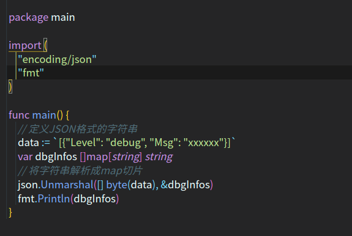
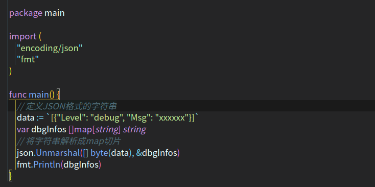
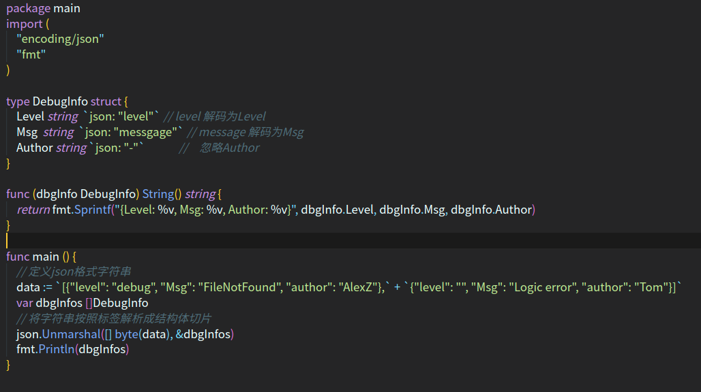
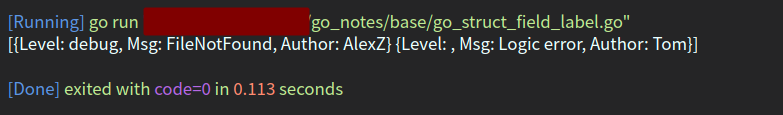
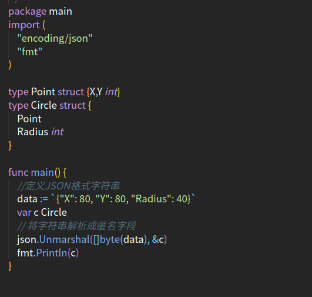
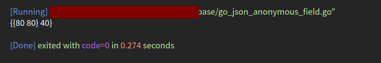

<!--
 * @Author: your name
 * @Date: 2021-06-29 16:54:21
 * @LastEditTime: 2021-07-01 15:30:55
 * @LastEditors: Please set LastEditors
 * @Description: https://github.com/xx19941215/light-go/blob/master/c05/c05_1/main.go
 * @FilePath: /go_notes/docs/go 序列化与反序列化.md
-->

# json序列化
json 序列化是指，将有 key-value 结构的数据类型(比如结构体、map、切片)序列化成 json 字符串的操作。
- 结构体序列化
- map序列化
- 切片序列化

## 结构体序列化

对于结构体的序列化，如果我们希望序列化后的 key 的名字，又我们自己重新制定，那么可以给 struct指定一个 tag 标签.


# 反序列化

在反序列化一个json字符串时，要确保反序列化后的数据类型和原来序列化前的数据类型一致。
//如果 json 字符串是通过程序获取到的，则不需要再对 “ 转义处理。

## JSON转切片



运行结果



在解码过程中，json包会将JSON类型转换为Go类型，转换规则如下:
```
JSON boolean -> bool
JSON number -> float64 JSON string -> string JSON 数组 -> [] interface{} JSON

object -> map null -> nil

```

## JSON 转结构体
## 结构体字段标签

解码时依然支持结构体字段标签，规则和编码时一样





## 字符串解析成匿名字段
在解码JSON时，如果找不到字段，则查找字段的字段




# 面试题
>  1. json包里使用的时候，结构体里的变量不加tag能不能正常转成json里的字段？

- 如果变量首字母小写，则为private。无论如何不能转，因为取不到反射信息。

- 如果变量首字母大写，则为public。

  -  不加tag，可以正常转为json里的字段，json内字段名跟结构体内字段原名一致。
  - 加了tag，从struct转json的时候，json的字段名就是tag里的字段名，原字段名已经没用。

```golang

package main
import (
    "encoding/json"
    "fmt"
)
type J struct {
    a string             //小写无tag
    b string `json:"B"`  //小写+tag
    C string             //大写无tag
    D string `json:"DD"` //大写+tag
}
func main() {
    j := J {
      a: "1",
      b: "2",
      C: "3",
      D: "4",
    }
    fmt.Printf("转为json前j结构体的内容 = %+v\n", j)
    jsonInfo, _ := json.Marshal(j)
    fmt.Printf("转为json后的内容 = %+v\n", string(jsonInfo))
}

```

输出

```
转为json前j结构体的内容 = {a:1 b:2 C:3 D:4}
转为json后的内容 = {"C":"3","DD":"4"}

```

<b>详解</b>
- 结构体里定义了四个字段，分别对应 小写无tag，小写+tag，大写无tag，大写+tag。
- 转为json后首字母小写的不管加不加tag都不能转为json里的内容，而大写的加了tag可以取别名，不加tag则json内的字段跟结构体字段原名一致。
