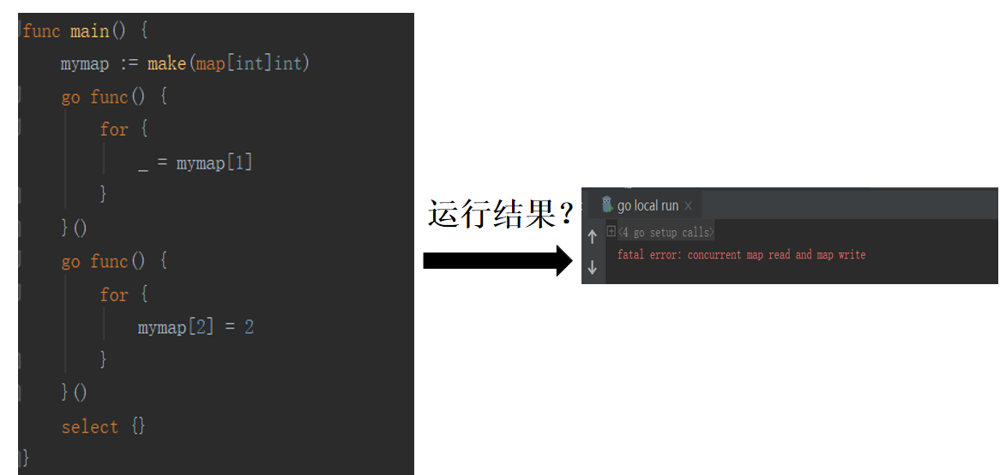
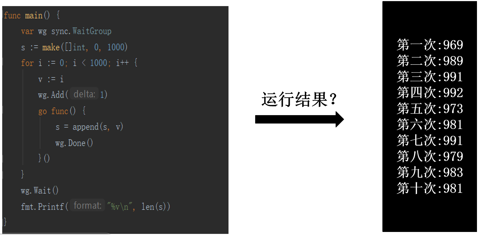

- 并发问题
- 解决方案
- 性能问题




--- 
在 Go 中，容器类型本身并不是并发安全的。这意味着，如果多个 goroutine 同时访问同一个容器类型的变量，并对它们进行写操作，那么就可能导致数据不一致或者其他问题。

为了解决这个问题，Go 提供了一个内置的包，称为 sync，它提供了用于实现同步的工具。例如，使用 sync.Mutex 类型的互斥锁可以实现对容器类型的并发访问控制，以避免数据不一致的问题。

下面是一个简单的例子：

```golang
import (
    "sync"
)

var m sync.Mutex
var myMap map[string]int

func updateMap(key string, value int) {
    m.Lock()
    defer m.Unlock()
    myMap[key] = value
}

func main() {
    // 初始化 myMap
    myMap = make(map[string]int)

    // 并发地调用 updateMap
    go updateMap("x", 1)
    go updateMap("y", 2)
}

```
在这个例子中，我们使用了 sync.Mutex 来保护对 myMap 的并发访问。具体来说，我们在调用 updateMap 函数时，使用 m.Lock() 来锁定互斥锁，并在函数返回时使用 defer m.Unlock() 来释放锁定。这样，在 updateMap 函数中对 myMap 的写操作就变成了原子操作，并发安全性得到了保障。