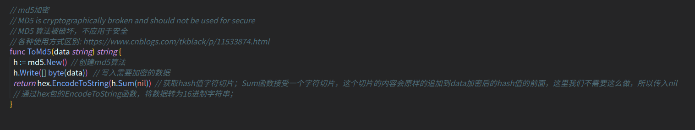

<!--
 * @Author: your name
 * @Date: 2021-07-05 16:25:01
 * @LastEditTime: 2021-07-05 16:51:12
 * @LastEditors: Please set LastEditors
 * @Description: In User Settings Edit
 * @FilePath: /go_notes/docs/golang标准库-crypto-md5.md
-->
> 本文讲解如何使用go封装好的md5算法，不深入剖析md5算法原理。 首先我们要知道md5算法属于hash算法的一种，所以在了解md5之前，我们先认识一下go提供的hash接口。hash算法是保证只要输入的值不同，就一定会得到两个不同的指定长度的hash值。当前两个不同值产生相同的hash还是有可能的，只是这个可能性很小很小

# md5.Sum(data)

# md5.New().Sum(data)

