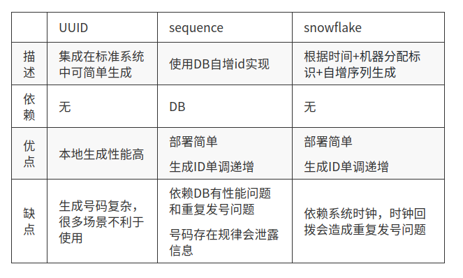
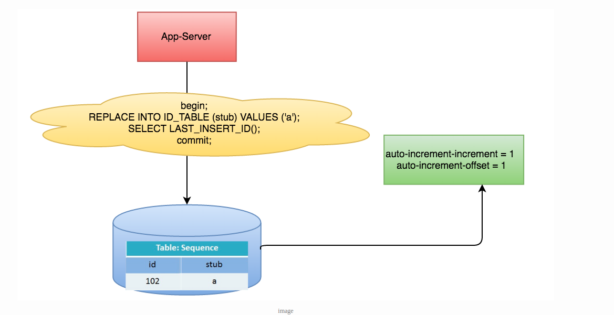
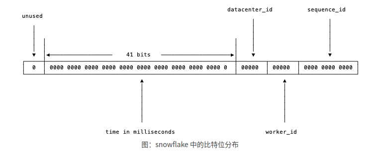
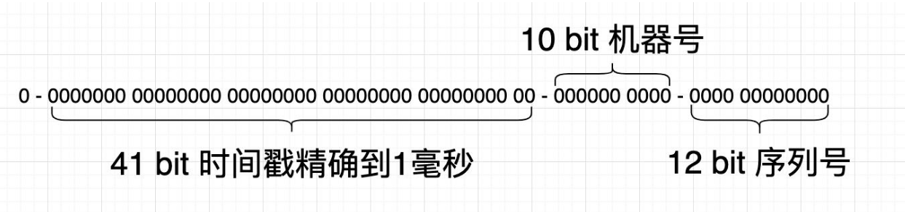

<!--
 * @Author: your name
 * @Date: 2021-11-08 15:19:33
 * @LastEditTime: 2021-11-09 20:08:13
 * @LastEditors: Please set LastEditors
 * @Description: 打开koroFileHeader查看配置 进行设置: https://github.com/OBKoro1/koro1FileHeader/wiki/%E9%85%8D%E7%BD%AE
 * @FilePath: /go_notes/docs/go实现分布式ID生成器.md
-->
# 一、背景
伴随互联网的发展，无论分布式系统、还是存储都变得更复杂、数据量更大，这些都需要唯一的标识记录。

简单举例，数据库单表时，通常使用数据库自带的自增ID就可以了，但分库分表后，数据库自带的自增ID就无法满足需求了，我们需要有一个算法或服务来生产分布式ID。

这时候我们需要能够生成类似MySQL自增ID这样不断增大，同时又不会重复的ID，以支持业务中的高并发场景

很多公司都会自研唯一ID生成服务，来满足唯一标识的问题。

# 二、全局唯一ID使用场景

比较典型的，如电商促销时，短时间内会有大量的订单涌入系统，如每秒10万多。
明星有大事件发生时，会有大量热情的粉丝发微博以表心意，同样会在短时间内产生大量的消息。
在插入数据库之前，需要给这些消息、订单先打上一个ID，然后再插入数据库。对这个ID的要求是希望其中能带有一些时间信息，这样即使我们后端的系统对消息进行了分库分表，也能够以时间顺序对这些消息进行排序。

总结常见的有：

- 分布式系统设计时，数据分片场景下，通常需要一个全局唯一id；
- 在消息系统中需要消息唯一ID标识来防止消息重复；
- 多系统打通需要一个全局唯一标识 （如集团各业务线面对不同用户，需要一个全局用户id）。

#  三、设计原理

<b>常见的我们几种实现方式:</b> 



|   |   UUID|  sequence | Redis|  Snowflake  |  Leaf |
|---|---|---|---|---|---|
| 描述  |  集成在标准系统中可简单生成 |使用DB自增id实现  |  |根据时间 + 机器分配标识 +  自增序列生成　|
| 依赖  |无   | DB |   | 无|
| 顺序性 |无序   |  |  单调递增 |趋势递增|趋势递增|
| 重复性 |  通过多位随机字符达到极低重复概率，但理论上是会重复的 | | RDB 持久化模式下，会出现重复  | 不会重复| 不会重复|
|可用性|一直可用||Redis 宕机后不可用|发生时钟回拨并且回拨时间超过等待阈值时不可用| 如果数据库宕机并且获取步长内的 ID 用完后不可用|
| 优点 |  本地生成，性能高 | 部署简单，生成ID单调递增|   |
| 缺点 |   生成号码复杂，很多场景不利于使用| 依赖DB有性能问题和重复发号问题　　号码存在规律会泄露信息|依赖系统时钟，时钟回拨会造成重复发号问题   |
|部署方式|JDK 直接调用 ||Jedis 客户调用|集成部署、集群部署|集成部署、集群部署|
|可用性| 永久||永久|69年|永久|


## 1. UUID
Universally Unique Identifier 是自由软件基金会组织制定的唯一辨识ID生成标准，大多数系统已实现，如微软的GUID实现。

生成格式如：3d422567-f034-4ab4-b98f-a34fd263d0de
包含32个16进制数字，以连字号分为五段，形式为8-4-4-4-12的36个字符
到目前为止业界一共有5种方式生成UUID，详情见IETF发布的UUID规范 
[A Universally Unique IDentifier (UUID) URN Namespace](https://www.ietf.org/rfc/rfc4122.txt)

<b>优点：</b>

- 性能非常高：本地生成，没有网络消耗。

<b>缺点：</b>

- 不易于存储：UUID太长，16字节128位，通常以36长度的字符串表示，很多场景不适用。
- 信息不安全：基于MAC地址生成UUID的算法可能会造成MAC地址泄露，这个漏洞曾被用于寻找梅丽莎病毒的制作者位置。
- ID作为主键时在特定的环境会存在一些问题，比如做DB主键的场景下，UUID就非常不适用：


> ① MySQL官方有明确的建议主键要尽量越短越好[4]，36个字符长度的UUID不符合要求。
> All indexes other than the clustered index are known as secondary indexes. In InnoDB, each record in a secondary index contains the primary key columns for the row, as well as the columns specified for the secondary index. InnoDB uses this primary key value to search for the row in the clustered index.*** If the primary key is long, the secondary indexes use more space, so it is advantageous to have a short primary key***.


## 2.  sequence表 (数据库生成)
使用DB统一维护一张(N张)发号表，使用主键自增值生成唯一ID
生成格式如：1,2,3,4,5....（递增数字）

以MySQL举例，利用给字段设置auto_increment_increment和auto_increment_offset来保证ID自增，每次业务使用下列SQL读写MySQL得到ID号。
```
begin;
REPLACE INTO Tickets64 (stub) VALUES ('a');
SELECT LAST_INSERT_ID();
commit;
```



这种方案的优缺点如下：

<b>优点：</b>

非常简单，利用现有数据库系统的功能实现，成本小，有DBA专业维护。
ID号单调自增，可以实现一些对ID有特殊要求的业务。

<b>缺点：</b>

强依赖DB，当DB异常时整个系统不可用，属于致命问题。配置主从复制可以尽可能的增加可用性，但是数据一致性在特殊情况下难以保证。主从切换时的不一致可能会导致重复发号。
ID发号性能瓶颈限制在单台MySQL的读写性能。

> 对于MySQL性能问题，可用如下方案解决：
> 在分布式系统中我们可以多部署几台机器，每台机器设置不同的初始值，且步长和机器数相等。比如有两台机器。设置步长step为2，TicketServer1的初始值为1（1，3，5，7，9，11…）、TicketServer2的初始值为2（2，4，6，8，10…）  详细方案阅读[Ticket Servers: Distributed Unique Primary Keys on the Cheap](https://code.flickr.net/2010/02/08/ticket-servers-distributed-unique-primary-keys-on-the-cheap/)
> 
## 3.类 SnowFlake雪花算法

Twitter实现的算法，使用时间戳+机器分配标识+自增序列组成64位数字ID。

这种方案大致来说是一种以划分命名空间（UUID也算，由于比较常见，所以单独分析）来生成ID的一种算法，这种方案把64-bit分别划分成多段，分开来标示机器、时间等

生成格式如：1292755860950487050




- 1位最高位：符号位不使用（0表正数，1表负数）

- 41位时间戳：2^41-1个数字代表69年，所以设置发号起始时间最好为发号器首次运行时间 (1L<<41）/(1000L*3600*24*365)=69年

- 10位工作机器id：也会分为5位datacenterId和5位workerId,可以分别表示1024台机器

- 12位序列号：2^12-1个数字总共4095，同一毫秒同一机器节点可以并发产生4095个不同Id  理论上snowflake方案的QPS约为409.6w/s


数值是64位，int64类型，被划分为4部分,不含开头的第一位，第一位是符号位。后41位表示收到请求时的时间错戳（毫秒）
后面5位来表示机器的实例ID，再用5位来表示机器的实例id, 最后是12位的循环自增id（到达1111 1111 1111后会归零）

> 1. 这样的机制可以支持在同一台机器上在1毫秒内产生212（即4096）条消息，1秒内共产生409.6万条消息。从值域上来讲完全够用了。
> 
> 2. 数据中心加上实例ID共有10位，可以支持每个数据中心部署32台机器，所有数据中心共1024台实例。

> 3. 表示时间戳的41位，可以支持我们使用69年。当然，时间毫秒计数不会真的从1970年开始，因为那样我们的系统运行到2039/9/7 23:47:35就不能用了，所以这里的时间戳实际上只是相对于某个时间的增量。例如，如果我们的系统上线时间是2018-08-01，就可以把这个时间戳当作是从2018-08-01 00:00:00.000的偏移量。

这种方式的优缺点是：

<b>优点：</b>

毫秒数在高位，自增序列在低位，整个ID都是趋势递增的。
不依赖数据库等第三方系统，以服务的方式部署，稳定性更高，生成ID的性能也是非常高的。
可以根据自身业务特性分配bit位，非常灵活。

<b>缺点：</b>

强依赖机器时钟，如果机器上时钟回拨，会导致发号重复或者服务会处于不可用状态。


<b>应用举例Mongdb objectID</b>

[MongoDB官方文档](https://docs.mongodb.com/manual/reference/method/ObjectId/#description) ObjectID可以算作是和snowflake类似方法，通过“时间+机器码+pid+inc”共12个字节，通过4+3+2+3的方式最终标识成一个24长度的十六进制字符。

### 3.1 worker_id分配

- timestamp: 由程序运行生成
- datacenter_id: 需要在部署阶段获取，且一旦程序启动不可更改（如果可以随意更改，那么可能被不慎修改而造成最终生成的ID有冲突）
- worker_id: 需要在部署阶段获取，且一旦程序启动不可更改
- sequence_id: 由程序运行生成


一般不同数据中心的机器，会提供对应的获取数据中心ID的API，所以我们可以在部署阶段轻松地获取到datacenter_id，而worker_id是我们逻辑上给机器分配的ID，这怎么办呢？比较简单的想法是由能够提供这种自增ID功能的工具来支持，例如

```mysql
mysql> insert into a (ip) values ("10.1.2.101");
Query OK, 1 row affected (0.00 sec)

mysql> select last_insert_id();

+-------------------------+
|  last_insert_id()        |
+ -------------------------+
|                                      2 |
+-------------------------+

1 row in set (0.00 sec)
```

从MySQL中获取到worker_id之后，就把这个worker_id直接持久化到本地，以避免每次上线时都需要获取新的worker_id。让单实例的worker_id可以始终保持不变。

当然，使用MySQL相当于给简单的ID生成服务增加了一个外部依赖。依赖越多，服务的可运维性就越差。

考虑到集群中即使有单个ID生成服务的实例发生故障了，结果也就是损失一段时间的一部分ID，所以我们也可以更简单一些，即把worker_id直接写在工作进程的配置中，上线时，由部署脚本完成worker_id字段替换。

### 3.2 标准snowflake go实现

https://github.com/bwmarrin/是一个相当轻量化的snowflake的Go实现


```
+--------------------------------------------------------------------------+
| 1 Bit Unused | 41 Bit Timestamp |  10 Bit NodeID  |   12 Bit Sequence ID |
+--------------------------------------------------------------------------+


```

<b>使用</b>

```go

package main

import (
	"fmt"

	"github.com/bwmarrin/snowflake"
)

func main() {

	// Create a new Node with a Node number of 1
	node, err := snowflake.NewNode(1)
	if err != nil {
		fmt.Println(err)
		return
	}

	// Generate a snowflake ID.
	id := node.Generate()

	// Print out the ID in a few different ways.
	fmt.Printf("Int64  ID: %d\n", id)
	fmt.Printf("String ID: %s\n", id)
	fmt.Printf("Base2  ID: %s\n", id.Base2())
	fmt.Printf("Base64 ID: %s\n", id.Base64())

	// Print out the ID's timestamp
	fmt.Printf("ID Time  : %d\n", id.Time())

	// Print out the ID's node number
	fmt.Printf("ID Node  : %d\n", id.Node())

	// Print out the ID's sequence number
	fmt.Printf("ID Step  : %d\n", id.Step())

  // Generate and print, all in one.
  fmt.Printf("ID       : %d\n", node.Generate().Int64())
}

```

### sonyflake

sonyflake是索尼公司的一个开源项目，基本思路和snowflake差不多，不过在位分配上稍有不同

https://github.com/sony/sonyflake

```
39 bits for time in units of 10 msec
 8 bits for a sequence number
16 bits for a machine id


```

<b>使用示例</b>

https://github.com/sony/sonyflake/tree/master/example


## 4.  Leaf方案

### 4.1 Leaf-segment数据库方案

### 4.2 Leaf-snowflake方案

# 参考
- [美团点评分布式ID生成系统](https://tech.meituan.com/2017/04/21/mt-leaf.html)
- 《高性能MySQ》
- [在Go中仅使用MySQL实现高性能分布式ID生成器](https://jasonkayzk.github.io/2021/06/20/%E5%9C%A8Go%E4%B8%AD%E4%BB%85%E4%BD%BF%E7%94%A8MySQL%E5%AE%9E%E7%8E%B0%E9%AB%98%E6%80%A7%E8%83%BD%E5%88%86%E5%B8%83%E5%BC%8FID%E7%94%9F%E6%88%90%E5%99%A8/)
- [高性能分布式ID生成器实现方法总结](https://jasonkayzk.github.io/2021/06/20/%E9%AB%98%E6%80%A7%E8%83%BD%E5%88%86%E5%B8%83%E5%BC%8FID%E7%94%9F%E6%88%90%E5%99%A8%E5%AE%9E%E7%8E%B0%E6%96%B9%E6%B3%95%E6%80%BB%E7%BB%93/)
- 《go高级编程》