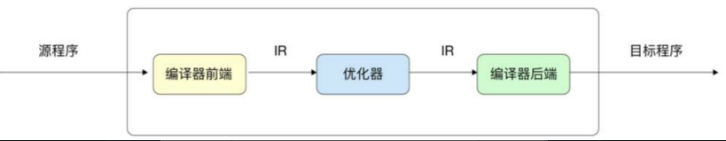
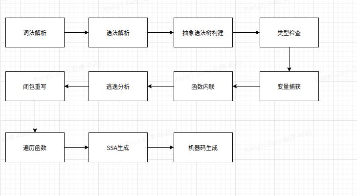
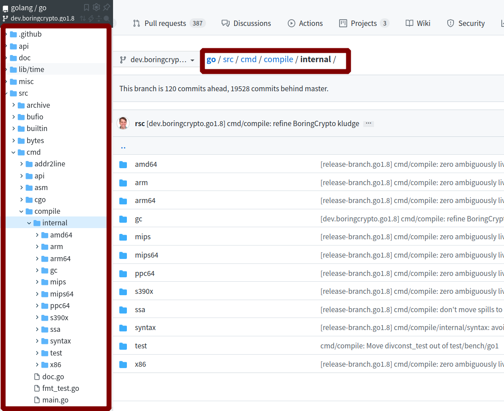

<!--
 * @Author: your name
 * @Date: 2021-11-10 17:53:44
 * @LastEditTime: 2021-11-11 11:25:08
 * @LastEditors: Please set LastEditors
 * @Description: 打开koroFileHeader查看配置 进行设置: https://github.com/OBKoro1/koro1FileHeader/wiki/%E9%85%8D%E7%BD%AE
 * @FilePath: /go_notes/docs/go编译器.md
-->
在经典的编译原理中，一般将编译器分为

- 编译器前端 : 主要专注于理解源程序,扫描解析源程序并进行精准的语义表达
- 中间阶段：　编译器的中间阶段（IntermediateRepresentation，IR）可能有多个，编译器会使用多个IR阶段、多种数据结构表示代码，并在中间阶段对代码进行多次优化
- 优化器: 　识别冗余代码、识别内存逃逸等。编译器的中间阶段离不开编译器前端记录的细节。
- 编译器后端：专注于生成特定目标机器上的程序，这种程序可能是可执行文件，也可能是需要进一步处理的中间形态obj文件、汇编语言等。




# go 编译器

Go语言编译器一般缩写为小写的gc（gocompiler），需要和大写的GC（垃圾回收）进行区分。

Go语言编译器的执行流程可细化为多个阶段，包括词法解析、语法解析、抽象语法树构建、类型检查、变量捕获、函数内联、逃逸分析、闭包重写、遍历函数、SSA生成、机器码生成



## 词法解析

go源码: https://github.com/golang/go

Go语言编译器有关的代码主要位于src/cmd/compile/internal目录下



```golang
 // go/src/cmd/compile/internal/


```

## 语法解析

## 抽象语法树
     
## 类型检查

## 变量捕获

## 函数内联

## 逃逸分析

## 闭包重写

## 遍历函数

## SSA生成

## 机器码生成

