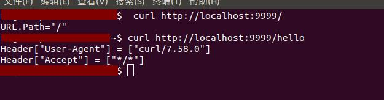
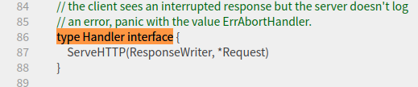
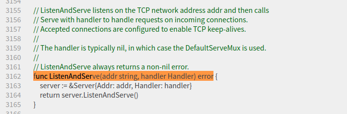
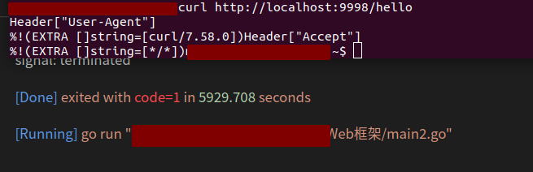

<!--
 * @Author: your name
 * @Date: 2021-04-16 16:21:53
 * @LastEditTime: 2021-04-16 18:00:39
 * @LastEditors: Please set LastEditors
 * @Description: In User Settings Edit
 * @FilePath: /go_notes/docs/go语言启动一个web服务.md
-->

# net/http库
Go语言内置了 net/http库，封装了HTTP网络编程的基础的接口，我们实现的Gee Web 框架便是基于net/http的。我们接下来通过一个例子，简单介绍下这个库的使用。

```

package main

import (
	"fmt"
	"log"
	"net/http"
)

func main() {
	http.HandleFunc("/", indexHandler)
	http.HandleFunc("/hello", helloHandler)
	log.Fatal(http.ListenAndServe(":9999", nil))
}

// handler echoes r.URL.Path
func indexHandler(w http.ResponseWriter, req *http.Request) {
	fmt.Fprintf(w, "URL.Path=%q\n", req.URL.Path)
}

// handler echoes r.URL.Header
func helloHandler(w http.ResponseWriter, req *http.Request) {
	for k,v := range req.Header{
		fmt.Fprintf(w, "Header[%q] = %q\n", k,v)
	}
}
```
我们设置了2个路由，/和/hello，分别绑定 indexHandler 和 helloHandler ， 根据不同的HTTP请求会调用不同的处理函数。访问/，响应是URL.Path = /，而/hello的响应则是请求头(header)中的键值对信息。

用 curl 这个工具测试一下，将会得到如下的结果。
```

$ curl http://localhost:9999/
URL.Path = "/"
$ curl http://localhost:9999/hello
Header["Accept"] = ["*/*"]
Header["User-Agent"] = ["curl/7.54.0"]
```




main 函数的最后一行，是用来启动 Web 服务的，第一个参数是地址，:9999表示在 9999 端口监听。而第二个参数则代表处理所有的HTTP请求的实例，nil 代表使用标准库中的实例处理。第二个参数，则是我们基于net/http标准库实现Web框架的入口。

# 实现http.Handler接口

```
package http
type Handler interface {
    ServeHTTP(w ResponseWriter, r * Request)
}

func ListenAndServe(address string, h Handler) error
```
https://golang.org/src/net/http/server.go?s=99574:99629#L3152


第二个参数类型是什么呢？
通过查看net/http源码可以发现， Handler是一个接口

需要实现方法 ServeHTTP ，也就是说，只要传入任何实现了 ServerHTTP 接口的实例，所有的HTTP请求，就都交给了该实例处理了。

```

/*
 * @Author: your name
 * @Date: 2021-04-16 17:02:44
 * @LastEditTime: 2021-04-16 17:39:30
 * @LastEditors: Please set LastEditors
 * @Description: In User Settings Edit
 * @FilePath: /go_notes/Web框架/main2.go
 */

 package main
 
 import (
	 "fmt"
	 "log"
	 "net/http"
 )

 // engine is the uni handler for all requests
 // 定义个空结构体
 type Engine struct{}

 // 实现方法ServeHTTP
 // 这个方法有2个参数，第二个参数是 Request ，该对象包含了该HTTP请求的所有的信息，比如请求地址、Header和Body等信息；第一个参数是 ResponseWriter ，利用 ResponseWriter 可以构造针对该请求的响应。
 func (engin *Engine) ServeHTTP(w http.ResponseWriter, req *http.Request) {
	 switch req.URL.Path {
	 case "/":
		fmt.Fprintf(w, "URL.Path")
	case "/hello":
		for k,v := range req.Header{
			fmt.Fprintf(w, "Header[%q]\n", k,v)
		}	
	default:
		fmt.Fprintf(w, "404 NOT FOUND: %s\n", req.URL)	 
	 }
 }

 func main() {
	 engine := new(Engine)
	log.Fatal(http.ListenAndServe(":9999", engine))
 }

```


我们定义了一个空的结构体Engine，实现了方法ServeHTTP。这个方法有2个参数，第二个参数是 Request ，该对象包含了该HTTP请求的所有的信息，比如请求地址、Header和Body等信息；第一个参数是 ResponseWriter ，利用 ResponseWriter 可以构造针对该请求的响应。

在 main 函数中，我们给 ListenAndServe 方法的第二个参数传入了刚才创建的engine实例。至此，我们走出了实现Web框架的第一步，即，将所有的HTTP请求转向了我们自己的处理逻辑。还记得吗，在实现Engine之前，我们调用 http.HandleFunc 实现了路由和Handler的映射，也就是只能针对具体的路由写处理逻辑。比如/hello。但是在实现Engine之后，我们拦截了所有的HTTP请求，拥有了统一的控制入口。在这里我们可以自由定义路由映射的规则，也可以统一添加一些处理逻辑，例如日志、异常处理等。

代码的运行结果与之前的是一致的。



# 搭建框架雏形