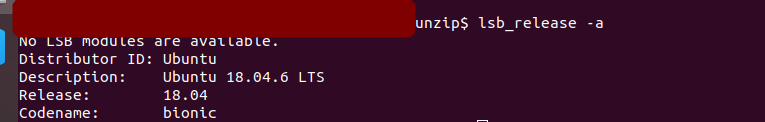
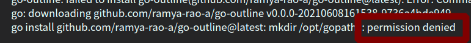

#! https://zhuanlan.zhihu.com/p/431741366
<!--
 * @Author: your name
 * @Date: 2021-11-10 16:09:24
 * @LastEditTime: 2021-11-10 17:23:08
 * @LastEditors: Please set LastEditors
 * @Description: 打开koroFileHeader查看配置 进行设置: https://github.com/OBKoro1/koro1FileHeader/wiki/%E9%85%8D%E7%BD%AE
 * @FilePath: /go_notes/docs/linux中使用root权限运行vscode编辑器.md
-->

# linux中使用root权限运行vscode编辑器
查看操作环境

OS Version:

```
 lsb_release -a
No LSB modules are available.
Distributor ID:	Ubuntu
Description:	Ubuntu 18.04.6 LTS
Release:	18.04
Codename:	bionic

```




VisualStudioCode Version:

```

code -v
1.61.2
6cba118ac49a1b88332f312a8f67186f7f3c1643
x64

```

## 问题背景

在 Linux 普通用户模式下使用 VSCode编辑权限受限文件，或者用vscode吊起安装依赖脚本时候，常会遇到权限不足的情况

日吊起go install时候，因vscode权限不足，无法使用 mkdir等文件权限



这个时候如果能以管理员的身份运行 VSCode 则会省心不少。


## 解决方案

输入以下命令就能以 “Superuser” 的身份（ROOT 权限）运行 VSCode:

```
sudo code --user-data-dir ="~/.vscode-root"

```


如果不想完整的打出上述命令，也可以在打出 
```
sudo code --user-data-dir ="~/.vsc 
```
后按下 Tab 键自动补全，在我的操作环境下，补全后的命令是：

```

sudo code --user-data-dir ="/home/me/.vscode/"


```
回车使用上面的命令同样能以 ROOT 权限运行 VSCode.