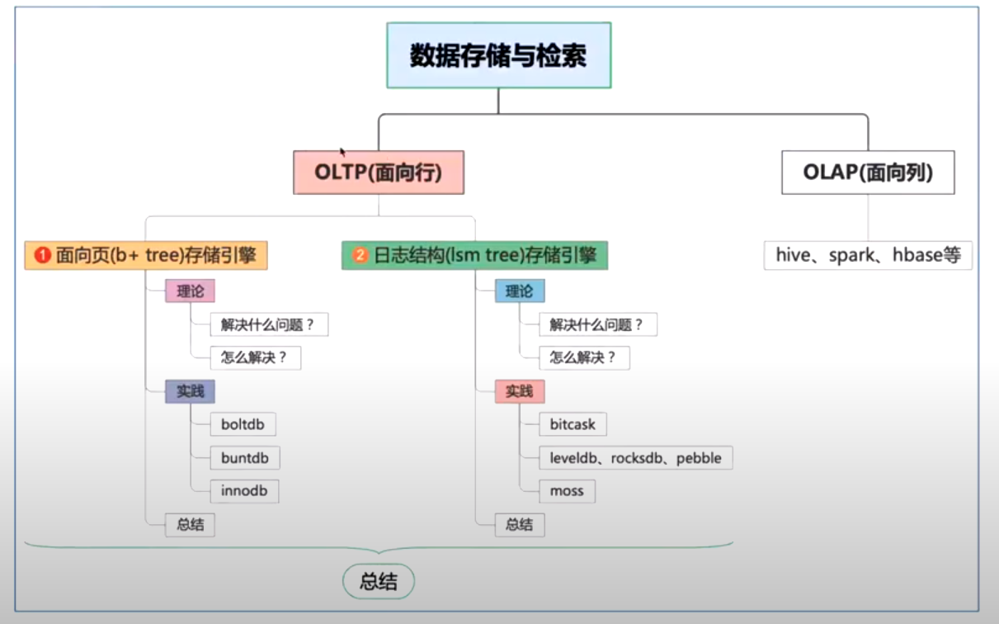

LSM tree是一种数据结构，用于存储和管理数据。它有助于提高数据查询和写入的性能，并有一些独特的特性，使它适用于一些特定的用途。

Bitcask、Moss和LevelDB都是基于LSM tree的存储引擎，它们都具有LSM tree的一些优点，如快速查询和写入等。

Bitcask是一个基于内存的存储引擎，它的目标是提供高性能的读写操作。它通过分散数据来实现并发操作，并且提供了一些特殊的工具来帮助恢复数据。

Moss是一个更复杂的LSM tree存储引擎，它专门为分布式系统设计。它支持分布式事务、版本管理和容错功能，并提供了一些特殊的工具来帮助查询和管理数据。

LevelDB是一个简单的LSM tree存储引擎，它专门为嵌入式系统设计。它提供了简单的API和良好的性能，并且支持跨平台使用。它的目标是为应用程序提供快速的读写操作。

总的来说，LSM tree存储引擎提供了一种快速、高效的方法来存储和管理数据，它们适用于一些特定的用途，并且各自具有独特的特性和优势。
# 数据存储与检索背景

| 维度   | OLTP(online transaction processing)　面向行 | OLAP(online analysis processing)　面向列 |
|------|-----------------------------------------|--------------------------------------|
| 系统功能 | 日常交易处理/在线事务处理                           | 统计、分析、报表/在线分析处理                      |
| 设计目标 | 面向实时交易类应用                               | 面向统计分析类应用                            |
| 数据处理 | 当前的。最新的                                 | 历史的，集聚的                              |
| 实时性  | 实时性读写要求高                                | 实时性读写要求低                             |
| 事务   | 强事务                                     | 弱事务                                  |
| 分析要求 | 低、简单                                    | 高、复杂                                 |

# 基于结构的存储引擎

# 面向页(b+ tree)存储引擎

# 基于日志结构(lsm tree)存储引擎

## 理论

## 实践

## 总结

# 参考
- http://kernelmaker.github.io/
- www.cs.umb.edu/~poneil/lsmtree.pdf
- https://kernelmaker.github.io/lsm-tree
