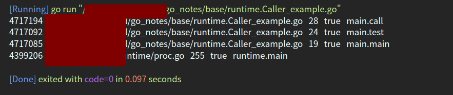

<!--
 * @Author: your name
 * @Date: 2022-04-26 14:46:14
 * @LastEditTime: 2022-04-26 15:25:40
 * @LastEditors: Please set LastEditors
 * @Description: 打开koroFileHeader查看配置 进行设置: https://github.com/OBKoro1/koro1FileHeader/wiki/%E9%85%8D%E7%BD%AE
 * @FilePath: /go_notes/docs/runtime.Caller理解.md
-->
```
func Caller(skip int) (pc uintptr, file string, line int, ok bool)
```

- <b>参数</b>: skip是要提升的堆栈帧数，0-当前函数，1-上一层函数，....
- <b>返回值</b>：

     -  `pc`是uintptr这个返回的是函数指针

     - ` file`是函数所在文件名目录

      - `line`所在行号

     - `ok` 是否可以获取到信息


# 示例
我们分别打印skip为0-3的相关信息

```
package main
 
import (
	"fmt"
	"runtime"
)
 
func main() {
	for i := 0 ; i< 4; i++ {
		test(i)
	}
}
 
func test(skip int) {
	call(skip)
}
 
func call(skip int) {
	pc,file,line,ok := runtime.Caller(skip)
	pcName := runtime.FuncForPC(pc).Name()  //获取函数名
	fmt.Println(fmt.Sprintf("%v   %s   %d   %t   %s",pc,file,line,ok,pcName))
}


```
<b>结果：</b>


分析结果可以看到0-3分别上当前函数，当前函数的上一个caller,....
