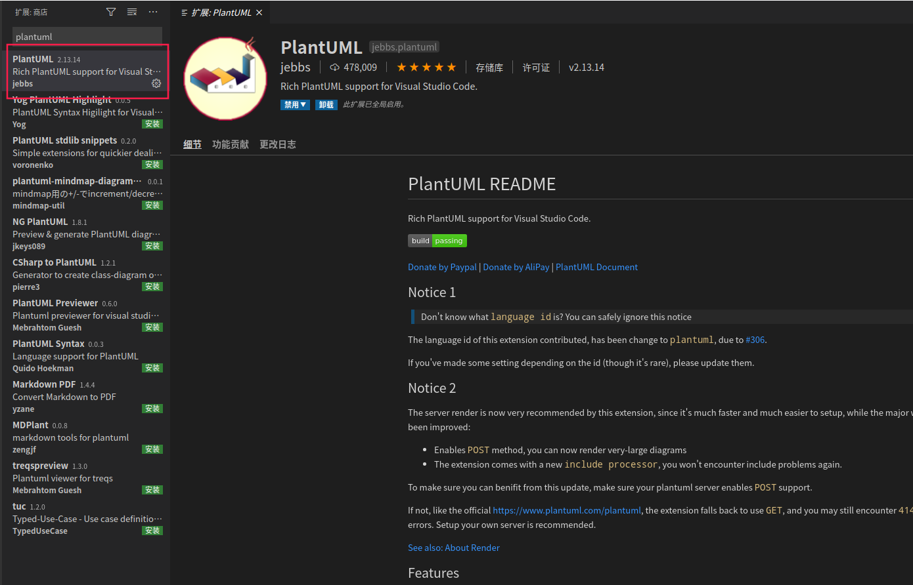
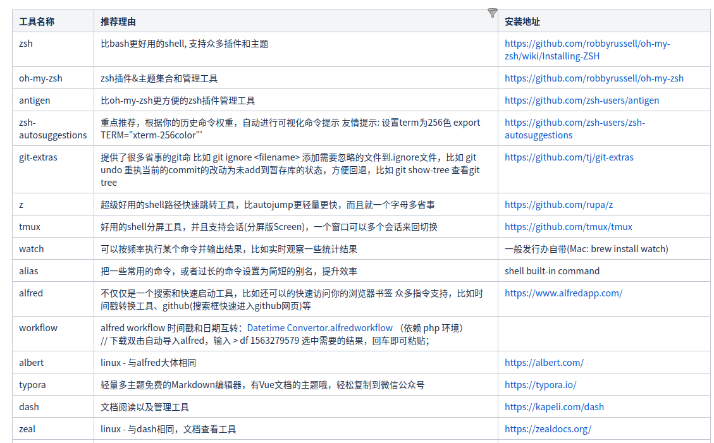
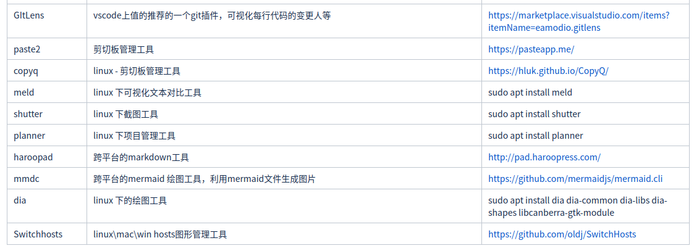
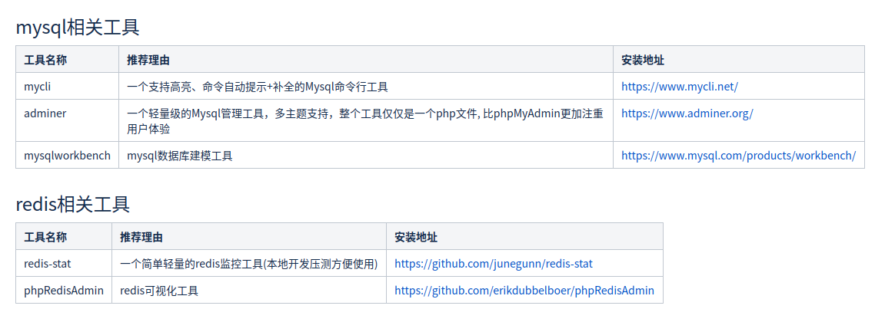

<!--
 * @Author: your name
 * @Date: 2021-04-02 16:43:17
 * @LastEditTime: 2021-04-02 18:30:25
 * @LastEditors: Please set LastEditors
 * @Description: In User Settings Edit
 * @FilePath: /go_notes/docs/常用开发工具.md
-->
# 在线小工具
开发中使用到的小工具

JSON在线解析 http://json.cn/

生成二维码 https://cli.im/text


# 安装工具

## PlantUML画图

```
安装步骤

sudo apt-get install graphviz

sudo apt-get install graphviz graphviz-doc
```

安装plantUML插件

Ctrl+Shift+X  快捷键打开拓展安装界面，输入  PlantUML  安装插件



创建.puml 文件即可生成UML图  (ALT+D UML图预览) 
#其他推荐





```bash
#!/bin/bash
cmd=$0
downloads="$HOME/downloads"
if ! test -d $downloads; then
	mkdir -p $downloads
fi
INSTALL=`which yum || which apt || which apt-get || which brew`
if [ "$INSTALL" = "" ]; then
    echo "Has no yum or apt-get or brew!"
    exit -1
fi


INSTALL="$INSTALL -y"

devtools(){
	echo "== begin install_devtools ..."
	# 安装开发工具
	$INSTALL vim git gcc-6 g++-6 make cmake npm python-pip
	# 安装docker环境
	$INSTALL docker.io docker-compose etcd 
	# 安装k8s
	sudo snap install microk8s --beta --classic
	# 安装redis和mysql
	$INSTALL redis mysql-server
	# 安装nodejs
	$INSTALL npm nodejs node-typescript
	npm install -g gulp-cli
    npm install --save-dev typescript gulp gulp-typescript
	# 安装截图工具
	$INSTALL shutter
	# 安装项目管理工具
	$INSTALL planner
	# 安装文本比对工具
	$INSTALL meld
	# 安装markdown工具
	haroopad=`which haroopad`
	if [ $haroopad="" ]; then
		wget https://bitbucket.org/rhiokim/haroopad-download/downloads/haroopad-v0.13.2-x64.deb
		sudo dpkg -i haroopad-v0.13.2-x64.deb
	fi
	# 安装绘图工具 dia
	$INSTALL dia dia-common dia-libs dia-shapes libcanberra-gtk-module
	# 安装绘图工具 Visual Paradigm
	wget https://ca1.visual-paradigm.com/visual-paradigm/vpce15.1/20180931/Visual_Paradigm_CE_15_1_20180931_Linux64.sh -O $downloads/VisualParadigm_installer.sh
	chmod u+x $downloads/VisualParadigm_installer.sh
	sudo $downloads/VisualParadigm_installer.sh
	echo "== finish install_devtools"
}

wine(){
	git clone https://github.com/wszqkzqk/deepin-wine-ubuntu.git
	cd deepin-wine-ubuntu
	chmod u+x install.sh
	sudo ./install.sh
	wget http://mirrors.aliyun.com/deepin/pool/non-free/d/deepin.com.qq.im.light/deepin.com.qq.im.light_7.9.14308deepin8_i386.deb -O $downloads/deepin_QQ.deb
	sudo dpkg -i $downloads/deepin_QQ.deb
	wget http://mirrors.aliyun.com/deepin/pool/non-free/d/deepin.com.wechat/deepin.com.wechat_2.6.2.31deepin0_i386.deb -O $downloads/deepin.wechat.deb
	sudo dpkg -i $downloads/deepin.wechat.deb
}

golang(){
	echo "== begin install golang ..."
	$INSTALL curl
	GVM=`which gvm`
	if [ $GVM="" ]; then
    	bash < <(curl -s -S -L https://raw.githubusercontent.com/moovweb/gvm/master/binscripts/gvm-installer)
		[[ -s "$HOME/.gvm/scripts/gvm" ]] && source "$HOME/.gvm/scripts/gvm"
		echo '[[ -s "$HOME/.gvm/scripts/gvm" ]] && source "$HOME/.gvm/scripts/gvm"' >> ~/.bashrc
		GVM=`which gvm`
	fi
	proxy=`env | grep -i https_proxy`
	if [ "$proxy"="" ]; then
		echo "you haven't set http_proxy, maybe fail when install golang"
		proxy=`sudo netstat -natp|grep LISTEN|grep -E 'ss|shadowsocks'|awk '{print $4}'|grep -E '1080$'`
		if [ "$proxy"!="" ]; then
			export http_proxy="$proxy"
			export https_proxy="$proxy"
			export HTTP_PROXY="$proxy"
			export HTTPS_PROXY="$proxy"
		fi
	fi
	env|grep -i "http_proxy"
	latestVersion=`HTTP_PROXY="$HTTP_PROXY" http_proxy="$http_proxy" gvm listall|grep -E 'go([1-9]{1,2})(.[0-9]{1,2})(.[0-9]{1,2}){0,1}$'|tail -1|awk '{print $1}'`
	if [ "$latestVersion"="" ]; then
		echo "can't get latest vertion, use default version go1.11"
		latestVersion="go1.11"
	fi
	echo "install latest golang version $latestVersion"
	gvm install $latestVersion
	gvm version
	useVersion=`cat ~/.bashrc|grep "gvm use"|awk '{print $3}'`
	echo $useVersion
	if [ "$useVersion"="" ]; then
		echo "gvm use $latestVersion >> /dev/null" >> ~/.bashrc
	else
		sed -i "s/$useVersion/$latestVersion/g" ~/.bashrc
	fi
	echo "== finish install golang"
}

systools(){
	# 安装VPN, 在家办公连公司vpn用
	$INSTALL network-manager-openconnect network-manager-openconnect-gnome
	# 安装shadowsocks, 翻墙用
	sudo wget https://github.com/shadowsocks/shadowsocks-qt5/releases/download/v3.0.1/Shadowsocks-Qt5-3.0.1-x86_64.AppImage -O /usr/bin/shadowsocks-gui
	$INSTALL sysv-rc-conf rcconf
}

chrome(){
	# 安装chrome。调试时firfox没有chrome方便
	echo "== begin install_chrome ..."
	sudo rm /etc/apt/sources.list.d/google-chrome.list
	sudo wget http://www.linuxidc.com/files/repo/google-chrome.list -P /etc/apt/sources.list.d/
	wget -q -O - https://dl.google.com/linux/linux_signing_key.pub  | sudo apt-key add -
	sudo apt-get update
	$INSTALL google-chrome-stable
	echo "== finish install_chrome"
}

drivers(){
	# 安装显卡驱动
	echo "== begin install drivers ..."
	sudo add-apt-repository ppa:graphics-drivers/ppa
	sudo apt update
	sudo ubuntu-drivers autoinstall
	echo "== finish install drivers"
	echo "you need reboot your system"
}

tensorflow(){
	# 安装cuda以及tensorflow-gpu，仅适用于nvidia显卡
	echo "== begin install_tensorflow ..."
	$INSTALL nvidia-cuda-toolkit gcc-6 g++-6
	$INSTALL libcupti-dev
	export PATH=/usr/llib/cuda/bin${PATH:+:${PATH}}
	export LD_LIBRARY_PATH=/usr/lib/cuda/lib64:${LD_LIBRARY_PATH:+:${LD_LIBRARY_PATH}}
	pip install --upgrade tensorflow-gpu
	echo "== finish install_tensorflow"
}

all(){
	systools
	devtools
	chrome
	wine
	golang
	drovers
	tensorflow
}

help(){
	echo "
usage: $cmd [help | all | systools | chrome | wine | golang | devtools | drivers | tensorflow]
	help: show this help
	all: install all softwares
	systools: install system tools
	devtools: install development tools
	chrome: install chrome browser
	wine: install deepin wine
	golang: install golang
	drivers: install drivers
	tensorflow: install tensorflow
"
}

if test $# -eq 0; then
	help
	exit
fi

for a in $*
do
	case $a in
	help|all)
		if test $# -ne 1; then
			help
			exit 1
		fi
		;;
	esac
done
for a in $*
do
	$a
	if test $? -ne 0; then
		help
		exit 1
	fi
done

```