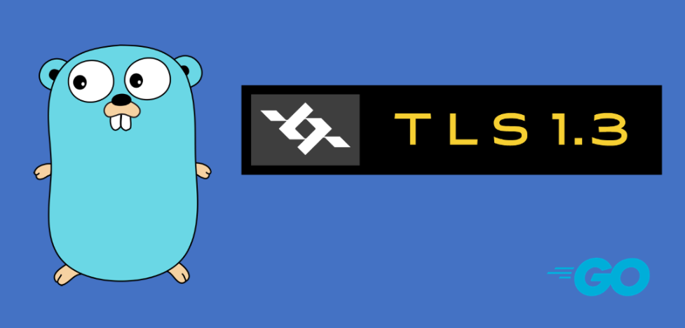

传输层安全协议（Transport Layer Security，缩写：TLS），及其前身安全套接层（Secure Sockets Layer，缩写：SSL）是一种安全协议，目的是为互联网通信提供安全及数据完整性保障。

SSL包含记录层（Record Layer）和传输层，记录层协议确定了传输层数据的封装格式。传输层安全协议使用X.509认证，之后利用非对称加密演算来对通信方做身份认证，之后交换对称密钥作为会谈密钥（Session key）。这个会谈密钥是用来将通信两方交换的数据做加密，保证两个应用间通信的保密性和可靠性，使客户与服务器应用之间的通信不被攻击者窃听。

更多内容看我这篇文章 [TLS详解](https://mp.weixin.qq.com/s?__biz=Mzg4MDY5NDU4NQ==&mid=2247485792&idx=1&sn=3a7fb872bcf8a30c02ec873469577533&chksm=cf700d36f8078420843f6ff1fd92925d2c7ab496a5d3c5a853de60efa91ab5f2cef91e1ea5bf&token=1936614066&lang=zh_CN#rd)

# 一、TLS历史
- 1994年早期，NetScape公司设计了SSL协议（Secure Sockets Layer）的1.0版，但是未发布。
- 1994年11月，NetScape公司发布SSL 2.0版，很快发现有严重漏洞。
- 1996年11月，SSL 3.0版问世，得到大规模应用。
- 1999年1月，互联网标准化组织ISOC接替NetScape公司，发布了SSL的升级版TLS 1.0版。
- 2006年4月和2008年8月，TLS进行了两次升级，分别为TLS 1.1版和TLS 1.2版。最新的变动是2011年TLS 1.2的修订版。
现在正在制定 tls 1.3。

# 二、证书生成
首先我们创建私钥和证书。

# go实现
Go Package tls部分实现了 tls 1.2的功能，可以满足我们日常的应用。Package crypto/x509提供了证书管理的相关操作。
# Reference 
- [golang-tls.md](https://gist.github.com/denji/12b3a568f092ab951456)
- [TLS详解](https://mp.weixin.qq.com/s?__biz=Mzg4MDY5NDU4NQ==&mid=2247485792&idx=1&sn=3a7fb872bcf8a30c02ec873469577533&chksm=cf700d36f8078420843f6ff1fd92925d2c7ab496a5d3c5a853de60efa91ab5f2cef91e1ea5bf&token=1936614066&lang=zh_CN#rd)
- https://zh.wikipedia.org/wiki/%E5%82%B3%E8%BC%B8%E5%B1%A4%E5%AE%89%E5%85%A8%E5%8D%94%E8%AD%B0
- RFC 8446：The Transport Layer Security (TLS) Protocol Version 1.3 – https://datatracker.ietf.org/doc/rfc8446/
- http://drops.wooyun.org/tips/6002
http://www.levigross.com/2015/11/21/mutual-tls-authentication-in-go/
https://github.com/nareix/blog/blob/master/posts/golang-tls-guide.md
http://www.ruanyifeng.com/blog/2014/02/ssl_tls.html
https://gist.github.com/spikebike/2232102
https://github.com/nareix/tls-example
http://seanlook.com/2015/01/07/tls-ssl/
https://golang.org/pkg/crypto/tls/
https://github.com/golang/net/tree/master/http2/h2demo