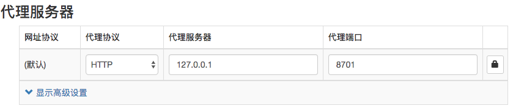
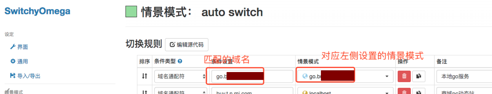

#! https://zhuanlan.zhihu.com/p/412793479
<!--
 * @Author: your name
 * @Date: 2021-04-02 16:09:55
 * @LastEditTime: 2021-09-22 16:23:43
 * @LastEditors: Please set LastEditors
 * @Description: In User Settings Edit
 * @FilePath: /go_notes/docs/如何管理代理和域名映射.md
-->
推荐大家使用 SwitchyOmega 来管理自己的域名映射，这样可以避免每次有变动都需要改动 hosts 文件。具体使用简单描述如下：

首先安装后进入配置场景：

其中代理服务器填写你服务所在机器ip，端口就是可访问的端口。比如以我们上面的Go服务为例，Go跑在我们本地，端口是 8701。

然后我为Go服务配置一个匹配域名

这样本地可直接访问： http://go.xxx.com  来访问我们自己运行的Go服务了。