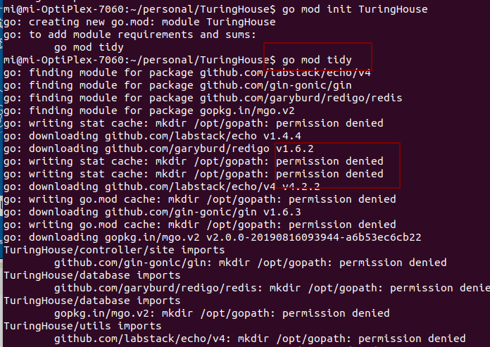
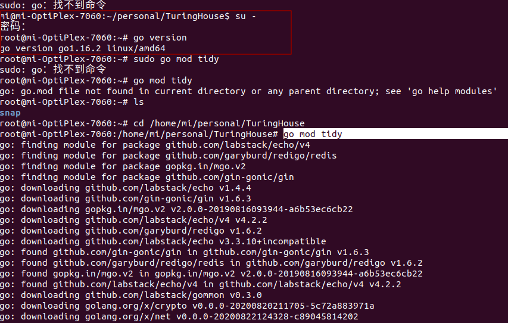

<!--
 * @Author: your name
 * @Date: 2021-04-08 09:51:41
 * @LastEditTime: 2021-04-08 10:37:53
 * @LastEditors: Please set LastEditors
 * @Description: In User Settings Edit
 * @FilePath: /go_notes/docs/常见答疑.md
-->

# go get 和go mod download不同
[What is the difference between go get command and go mod download command](https://stackoverflow.com/questions/66356034/what-is-the-difference-between-go-get-command-and-go-mod-download-command)

> Your module's go.mod file records which versions of dependencies it requires. The source code for those dependencies is stored in a local cache.

>go get updates the requirements listed in your go.mod file. It also ensures that those requirements are self-consistent, and adds new requirements as needed so that every package imported by the packages you named on the command line is provided by some module in your requirements.

>As a side-effect of updating and adding requirements, go get also downloads the modules containing the named packages (and their dependencies) to the local module cache.

>In contrast, go mod download does not add new requirements or update existing requirements. (At most, it will ensure that the existing requirements are self-consistent, which can occur if you have hand-edited the go.mod file.) It only downloads either the specific module versions you've requested (if you requested specific versions), or the versions of modules that appear in your requirements.

# linux下无法生成go.sum, 大概率权限问题

<b>问题</b>


<b>解决</b>

```
su -
cd /home/mi/personal/TuringHouse
go mod tidy

```


> Linux中切换用户的命令是su或su -,下面就su命令和su -命令最大的本质区别给大家详解一下：
> 前者只是切换了root身份，但Shell环境仍然是普通用户的Shell；而后者连用户和Shell环境一起切换成root身份了。只有切换了Shell环境才不会出现PATH环境变量错误。su切换成root用户以后，pwd一下，发现工作目录仍然是普通用户的工作目录；而用su -命令切换以后，工作目录变成root的工作目录了。用echo $PATH命令看一下su和su - 以后的环境变量有何不同。以此类推，要从当前用户切换到其它用户也一样，应该使用su -命令。
> https://blog.csdn.net/weixin_42670402/article/details/100056382