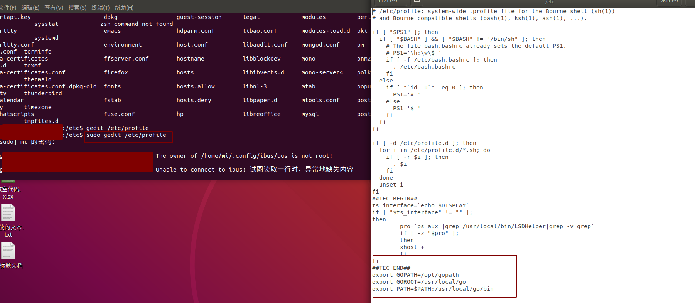

<!--
 * @Author: your name
 * @Date: 2021-04-01 20:55:30
 * @LastEditTime: 2021-04-02 10:38:47
 * @LastEditors: Please set LastEditors
 * @Description: In User Settings Edit
 * @FilePath: /go_notes/docs/搭建go开发环境.md
-->
一、Go 语言环境安装
1、下载二进制包

安装包下载地址为：https://golang.org/dl/。

如果打不开可以使用这个地址：https://golang.google.cn/dl/


各个系统对应的包名：

|    操作系统 | 包名  |
|  ----  | ----  |
| Mac  | go1.16.2.darwin-amd64.pkg  |
| Linux  | go1.16.2.linux-amd64.tar.gz  |
| Windows  | go1.16.2.windows-amd64.msi |

2、 解压到/user/local 目录

```

tar -C /usr/local -xzf go1.16.2.linux-amd64.tar.gz
```

3、将 /usr/local/go/bin 目录添加至PATH环境变量

> You can do this by adding the following line to your $HOME/.profile or /etc/profile (for a system-wide installation):
```
export PATH=$PATH:/usr/local/go/bin
```



> Note: Changes made to a profile file may not apply until the next time you log into your computer. To apply the changes immediately, just run the shell commands directly or execute them from the profile using a command such as source $HOME/.profile.


```
source /etc/profile
```

4、验证安装完毕
```
go version
```

5、 go env

