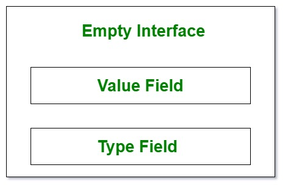
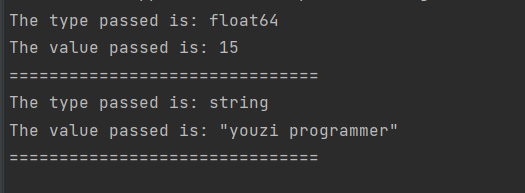

# 空接口 empty interface
当我们声明一个参数和数据类型未知的函数时，空接口非常有用。 Println、Printf 等库方法采用空接口作为参数。 空接口有一些隐藏的属性，赋予它功能。 数据通过以下方式抽象。



```golang
package main

import "fmt"

func observe(i interface{}) {
	// using the format specifier
	// %T to check type in interface
	fmt.Printf("The type passed is: %T\n", i)

	// using the format Specifier %#v
	// to check value in interface
	fmt.Printf("The value passed is: %#v \n", i)

	fmt.Println("===============================")
}

func main() {
	var value float64 = 15
	value2 := "youzi programmer"
	observe(value)
	observe(value2)
}

//在这里我们可以清楚地看到一个空接口将能够接受任何参数并适应它的值和数据类型。这包括但不限于结构和指向结构的指针。

```


在这里我们可以清楚地看到一个空接口将能够接受任何参数并适应它的值和数据类型。这包括但不限于结构structs 和指向结构的指针pointers to structs。